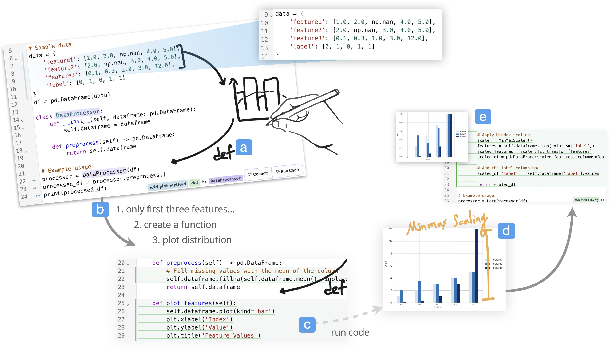

# Code Shaping

Code Shaping is a tool that allows you to edit code using free-form sketch annotations directly on top of the code and console output. Try out the online demo [here](https://annotate-edit.vercel.app) with your own API key!


## Code Shaping in Action
[](https://www.youtube.com/watch?v=9nypJeuNxNU)

## Getting Started
We recommend you using your tablet to experience the full interaction. You can do this by using ngrok to expose your local server to the internet.

1. Clone this repo to your computer
2. Run `npm install` to install dependencies
3. Get an OpenAI API key from [platform.openai.com/api-keys](https://platform.openai.com/api-keys). Make sure
   you are at least a
   [Tier 1](https://platform.openai.com/docs/guides/rate-limits/usage-tiers) API
   user, which means you have access to GPT-4o. You can check your tier on
   the [OpenAI API Limits](https://platform.openai.com/account/limits).
4. Create a `.env` file that contains `NEXT_PUBLIC_OPENAI_API_KEY=your api key here`
5. Run `npm run dev`
6. then expose your local server to the internet by running `ngrok http 3000`
7. Open the url provided by ngrok in your tablet


## How it works
You can start by adding code into the code editor, then you can add sketch annotations to the code to make code edits. You can also add sketch annotations to the console output to make console edits.

## How to use the tool:
1. You can use one finger tap and drag to select items on canvas;
2. Tap longer and drag will select code with contextual menu beside;
3. The always-on feedforward interpretation showing the interpretation of sketches or text, the reasoning of action, and the related code;
4. The gutter will be decorated to indicate which code being referenced and which code will be affected;
5. The related code syntax will be highlight transiently;
6. You can commit the changes and the code will be updated in the code editor;
7. Draw check/cross to accept/reject code edits.


## Acknowledgments
This codebase is largely developed based on [tldraw](https://github.com/tldraw/tldraw)'s [MakeReal project](https://github.com/tldraw/make-real).
This work was made possible by NSERC Discovery Grant RGPIN-2024-03827, NSERC Discovery Grant \#RGPIN-2020-03966, and Canada foundation for innovation - John R. Evans Leaders Fund (JELF) \#42371.

## License
This project is licensed under the MIT License - see the [LICENSE.md](LICENSE.md) file for details.

## Citation
```bibtex
@inproceedings{10.1145/3706598.3713822,
author = {Yen, Ryan and Zhao, Jian and Vogel, Daniel},
title = {Code Shaping: Iterative Code Editing with Free-form AI-Interpreted Sketching},
year = {2025},
isbn = {9798400713941},
publisher = {Association for Computing Machinery},
address = {New York, NY, USA},
url = {https://doi.org/10.1145/3706598.3713822},
doi = {10.1145/3706598.3713822},
abstract = {We introduce the concept of code shaping, an interaction paradigm for editing code using free-form sketch annotations directly on top of the code and console output. To evaluate this concept, we conducted a three-stage design study with 18 different programmers to investigate how sketches can communicate intended code edits to an AI model for interpretation and execution. The results show how different sketches are used, the strategies programmers employ during iterative interactions with AI interpretations, and interaction design principles that support the reconciliation between the code editor and sketches. Finally, we demonstrate the practical application of the code shaping concept with two use case scenarios, illustrating design implications from the study.},
booktitle = {Proceedings of the 2025 CHI Conference on Human Factors in Computing Systems},
articleno = {872},
numpages = {17},
keywords = {Ink-based Sketching, Dynamic Abstraction, Programming Interface},
location = {
},
series = {CHI '25}
}
```